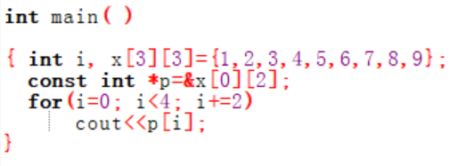
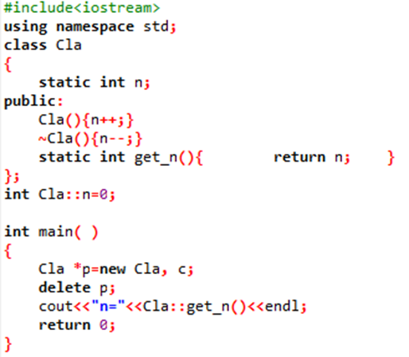
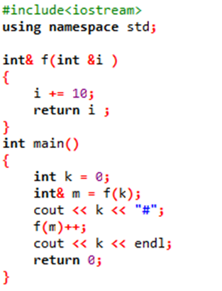
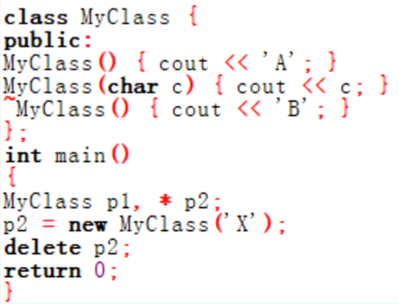
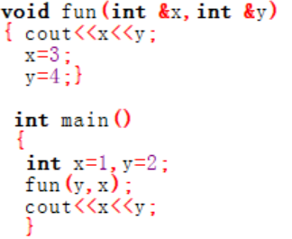

### 2402 - OOP - 上机2 - Lancer

------

#### 单选题

1. (2023final) 以下程序段的输出结果是（ ）。（C）

   

   A. 13

   B. 1234

   **C. 35**

   D. 3579

2. (2023final)若有以下调用语句，则不正确的 fun函数的首部是（   ）。（D）

   int main( )

   {

       int a[50]，n；

       fun(n，a+5)；

      }

   A. void fun(int m，int a[ ])

   B. void fun(int m，int a[41])

   C. void fun(int m，int *a)

   **D. void fun(int m，int a)**

3. (2023final) 下面对s的初始化正确的是(    )。（C）

   A. char s[5]="abcde";

   B. char s="abcd";

   **C. string s="abcd";**

   D. string s='ab';

4. (2023final) 下面程序的执行结果是（  ）。（B）

   

   A. n=0

   **B. n=1**

   C. n=2

   D. 语法错误

5. (2023final)下面程序的执行结果是（    ）。（D）

   

   A. 10#10

   B. 0#0

   C. 10#20

   **D. 10#21**

6. (2023final) 下列叙述中，正确的是（ ）。（A）

   **A. 类的构造函数可以重载**

   B. 类的析构函数可以重载

   C. 一个类可以没有构造函数

   D. 一个类可以没有析构函数

7. (2023final) cin 是由 I/O 流库预定义的（ ）。（B）

   A. 类

   **B. 对象**

   C. 包含文件

   D. 常量

8. (2023final) 已知display函数是一个常函数，它无返回值，下列声明中，（ ）是正确的。（D）

   A. const void display ( );

   B. void const display ( );

   C. void display (const);

   **D. void display ( ) const;**

9. (2023final) 以下程序不正确的是（ ）。（A）

   **A. int main(){**


    class A {

     int v;};

    A a;

    a.v=3;

    return 0;}

   B. int main() {


   class A {

   public:

     int v;

     A *p;};

     A a;

     a.p=&a;

    return 0;}

   C. int main(){


    class A {

     public:

      int v; };

      A *P=new A;

      p->v=4;

     delete p;

     return 0;}

   D. int main(){


    class A{

      public:

      int v;

      A *p;};

      A a;

      a.p=new A;

      delete a.p;

      return 0;}

10. （2023final）假设A是自定义的一个类，下面（    ）是正确的拷贝构造函数。（B）

   A. A()

   **B. A(const A& a)**

   C. A(const A& a, int i)

   D. A(const A* a)

11. （2023final）下列程序段的输出结果是（ ）。（D）

   

   A. ABX

   B. ABXB

   C. AXB

   **D. AXBB**

12. （2023final）假定A为一个类，a为该类私有的数据成员，若要在该类的一个成员函数print中访问它，则正确的格式为（  ）。（A）

   **A. cout<<a;**

   B. cout<< A::a;

   C. cout<< a();

   D. cout<< A::a();

13. （2023final）若需要为A类重载乘法运算符,运算结果为A类型,在将其声明为类的成员函数时,下列原型声明正确的是（ ）。（C）

   A. A*(A);

   B. operator*(A);

   **C. A operator*(A);**

   D. A operator*(A,A);

14. （2023final）下面对于友元函数描述正确的是(  )。（C）

   A. 友元函数的实现必须在类的内部定义

   B. 友元函数是类的成员函数

   **C. 友元函数破坏了类的封装性和隐藏性**

   D. 友元函数不能访问类的私有成员

15. （2023final）用new动态申请一个二维数组，则下列语句正确的是（    ）。（A）

   **A. int (* fp)[3]; fp=new int[3][3];**

   B. int *fp; fp=new int[3][3];

   C. int * fp[3]; fp=new int[3][3];

   D. int *fp [3][3]; fp=new int[3][3];

16. （2023final）下面关于运算符重载的论述中哪个是错误的（ ）。（C）

   A. 运算符重载函数可以返回任何类型

   B. 重载运算符时，运算符函数所做的操作不一定要保持C++中该运算符原有的含义

   **C. 用户可以定义新的运算符**

   D. C++编译器根据参数的个数和类型来决定调用哪个重载函数

17. （2023final）在C++中，编写一个内联函数Fun，使用int类型的参数，求其平方并返回，返回值也为int类型，下列定义正确的是 （ 　）。（B）

   A. int Fun(int x){return x*x;}

   **B. inline int Fun(int x){return x*x;}**

   C. int inline Fun(int x){return x*x;}

   D. int Fun(int x){ return x*x;} inline

18. （2023final）关于函数的默认参数，则下列语句正确的是（   ）。（C）

   A. void F(int x = 1, y = 2);

   B. void F(x = 1, int y);

   **C. void F(int x = 1, int y = 2);**

   D. void F(int x = 1; int y = 2);

19. （2023final）对于下面的几个函数，( ) 是重载函数。（B）

   void F(int x) {…} //1
   int F(int y) {…} //2
   int F(int i, int j) {…} //3
   float F(int x) {…} //4

   A. 1和4

   **B. 2和3**

   C. 3和4

   D. 4个全部

20. (2023final) 下列程序段的输出结果是（ ）。（D）

   

   A. 1 2 1 2

   B. 2 1 1 2

   C. 1 2 3 4

   **D. 2 1 4 3**

21. 下列关于this指针的叙述中，正确的是（    ）（D）

   A. 任何与类相关的函数都有this指针

   B. 类的成员函数都有this指针

   C. 类的构造函数没有this指针

   **D. 类的非静态成员函数才有this指针**

22. 如何区分自增运算符重载的前置形式和后置形式？（B）

   A. 重载时，前置形式的函数名是++operator，后置形式的函数名是operator ++

   **B. 后置形式比前置形式多一个 int 类型的参数**

   C. 无法区分，使用时不管前置形式还是后置形式，都调用相同的重载函数

   D. 前置形式比后置形式多一个 int 类型的参数

23. 在重载一个运算符时，如果其参数表中有一个参数，则说明该运算符是( )。（D）

   A. 一元成员运算符

   B. 二元成员运算符

   C. 一元友元运算符

   **D. 二元成员运算符或一元友元运算符**


------

#### 填空题

1.write the output of the code below.

write the output of the code below.
```
#include
using namespace std;
class TEST
{
int num;
public:
TEST( int num=0);
void increment( ) ;
~TEST( );
};
TEST::TEST(int num) : num(num)
{
cout << num << endl;
}
void TEST::increment()
{
num++;
}
TEST::~TEST( )
{
cout << num << endl;
}
int main( )
{
TEST array[2];
array[0].increment();
array[1].increment();
return 0;
}
```
One for each line:
line 1:
line 2:
line 3:
line 4:

答案：

1. 0
2. 0
3. 1
4. 1

2.除了可以通过对象名来引用静态成员，还可以使用@ 引用静态成员。

除了可以通过对象名来引用静态成员，还可以使用 引用静态成员。

答案：

1. 类名

3.有如下程序：请写出程序输出结果。

有如下程序：请写出程序输出结果。
```
class Test
{
public:
	Test(){cout<<"构造函数"<<endl;}
	~Test(){cout<<"析构函数"<<endl;}
};
void myfunc(){
	static Test obj;
}
int main()
{
	cout<<"main开始"<<endl;
	myfunc();
	cout<<"main结束"<<endl;
	return 0；
}
```

答案：

1. main开始
2. 构造函数
3. main结束
4. 析构函数


------

#### 程序填空题

WD影城会为当前正在上映的每一部影片统计当日票房和总票房，得到每日票房冠军和总票房冠军。

请补全以下程序，使其能够给出当日票房冠军和总票房冠军的影片信息。

```c++
#include <iostream>
#include <string>
using namespace std;

class Film_Info{
private:
    string FilmName;//上映影片名称
    int day_count;//上映天数
    int * incomes;//上映每日票房
    int amount;//上映总票房

public:
/*（Film_Info()）（2分）*/
    {
        FilmName='';
        day_count=0;
        incomes=0;
        amount=0;
    }

/*（Film_Info(string name, int days)）（2分）*/
    {
        FilmName=name;
        amount=0;
        day_count=days;
        incomes=new int[days];

        for (int i=0; i<days;i++)
        {
            cin>>incomes[i];
            amount+=incomes[i];
        }

        if (amount>bestamount) bestamount=amount;
        if (incomes[days-1]>bestincome) bestincome=incomes[days-1];
    }

/*（Film_Info(const Film_Info& film)）（2分）*/
    {
        FilmName=film.FilmName;
        amount=film.amount;
        day_count=film.day_count;
        incomes=new int[day_count];

        for (int i=0; i<day_count;i++)
        {
            incomes[i]=film.incomes[i];
        }

    }

    string getname()
    {
        return FilmName;
    }

    Film_Info & operator=(const Film_Info &);
/*（friend void calculating(Film_Info films[], int n, int& best4d, int& best4a);）（2分）*/
    static int bestamount;//最高总票房
    static int bestincome;//最高日票房
};

/*（Film_Info & Film_Info::operator=(const Film_Info &film)）（2分）*/
{
    FilmName=film.FilmName;
    amount=film.amount;
    day_count=film.day_count;
/*（incomes = new int[day_count];）（2分）*/
    for (int i=0; i<day_count;i++)
    {
        incomes[i]=film.incomes[i];
    }
    return *this;
}

/*（int Film_Info::bestamount = 0;）（2分）*/
/*（int Film_Info::bestincome = 0;）（2分）*/

/*（void calculating(Film_Info films[], int n, int& best4d, int& best4a)）（2分）*/
{//计算总票房冠军及当日票房冠军
    for(int i=0; i<n; i++)
    {
        if (films[i].amount==Film_Info::bestamount)
            best4a=i;
        if (films[i].incomes[films[i].day_count-1]==Film_Info::bestincome)
            best4d=i;
    }
    return;
}

int main() {
    Film_Info * currentfilms;

    int num;
    cin>>num;

    if (num>0)
/*（currentfilms = new Film_Info[num];）（2分）*/
   else
        return 0;

    for(int i=0; i<num; i++)
    {
        string name;
        int days;
        cin>>name>>days;
        Film_Info temp(name,days);
        currentfilms[i]=temp;
    }

    int bestoftheamount=0, bestoftheday=0;

    calculating(currentfilms,num, bestoftheday, bestoftheamount);//计算总票房冠军及当日票房冠军

    Film_Info bestfilm=currentfilms[bestoftheamount];
    Film_Info bestfilmoftheday=currentfilms[bestoftheday];

    cout<<"Best film of the amount is: "<<bestfilm.getname()<<endl;
    cout<<"Best film of the day is: "<<bestfilmoftheday.getname()<<endl;

    return 0;
}

```


------

#### 函数题

##### 1.(2023final)友元函数求矩形去掉所包含的最大圆后的面积

设计一个类Rectangle表示矩形，其中包括私有成员变量width和height分别表示矩形的宽度和高度。请实现一个友元函数CalculateArea，计算矩形面积减去其所包含的最大圆后的面积。pi取值为3.14。在友元函数中完成输出，结果保留两位小数(五舍六入)（格式输出控制如下：cout<

**函数接口定义：**
```c++
double CalculateArea(Rectangle& rect);
```
**裁判测试程序样例：**
```c++
#include
#include
using namespace std;
class Rectangle {
private:
double width;
double height;
//类的定义未完待续
/* 请在这里填写答案 */
int main() {
double width, height;
cin >> width;
cin >> height;
Rectangle rect(width, height);
CalculateArea(rect);
return 0;
}
```
**输入样例：**
在这里给出一组输入。例如：
```in
4 6
```
**输出样例：**
在这里给出相应的输出。例如：
```out
11.44
```

**code:**

```c++
public:
	Rectangle(double a, double b){
		width = a;
		height = b;
	}
	friend double CalculateArea(Rectangle&);
};
double CalculateArea(Rectangle& rect){
    double r = rect.width < rect.height ? rect.width / 2 : rect.height / 2;
    cout << fixed << setprecision(2) << rect.width * rect.height - 3.14 * r * r;
	return rect.width * rect.height - 3.14 * r * r;
}
```

##### 2.（2023final）==运算符的重载

关于学生的自定义类Student有三个数据成员，分别保存学生的姓名、学号和年龄。需要重载==运算符，能够判断Student类的对象是否相等（即姓名、学号和年龄都相等）
**函数接口定义：**
```c++
bool Student::operator==(const Student &student);
```
const Student &student为传入的Student类的对象的引用，函数返回值为真或假。
**裁判测试程序样例：**
```c++
#include
#include "string.h"
using namespace std;
class Student
{
public:
Student(char *name, int id, int age)
{
this->pName = new char[strlen(name) + 1];
strcpy(this->pName, name);
this->mID = id;
this->mAge = age;
}
// 重载==号操作符
bool operator==(const Student &student);
~Student()
{
if (this->pName != NULL)
{
delete[] this->pName;
}
}
private:
char *pName;
int mID;
int mAge;
};
/* 请在这里填写答案 */
int main()
{
char sName1[30], sName2[30];
int mID1, mID2, mAge1, mAge2;
cin >> sName1 >> mID1 >> mAge1 >> sName2 >> mID2 >> mAge2;
Student student1(sName1, mID1, mAge1);
Student student2(sName2, mID2, mAge2);
if (student1 == student2)
{
cout << "equal!" << endl;
}
else
{
cout << "not equal!" << endl;
}
}
```
**输入样例：**
在这里给出一组输入。例如：
```in
abc 11 13 abc 11 13
```
**输出样例：**
在这里给出相应的输出。例如：
```out
equal!
```

**code:**

```c++
bool Student::operator == (const Student &student){
    if(this->mID != student.mID || this->mAge != student.mAge)return 0;
    return !strcmp(this->pName, student.pName);
}
```

##### 3.(2023final)门诊就诊排队服务

Tom医生每次出专家门诊，会将门诊时间按照每15分钟划分一个就诊时间段，看诊一位病人。病人可以提前一天选择自己需要的就诊时间进行预约也可以直接到现场挂号就诊。
就诊日时，护士根据以下规则进行门诊就诊排队。
（1）     当天门诊前，护士将所有就诊预约，按照预约就诊时间依次放入就诊队列treating_list中
（2）     当天门诊中，护士将及时处理现场病人挂号需求和预约病人取消需求
（3）     现场病人是否能挂上号取决于当时是否还有空闲时间段，若有，护士将为其预约当前最早可就诊时间段，并放入就诊队列treating_list中,否则病人只能离开
（4）     接收到取消预约的需求后，护士将其从就诊队列中移除
（5）     Tom医生的就诊时间从StartingTime开始到EndingTime结束，期间每个小时的就诊时间段固定分为4个，分别是整点，整点15分，整点30分，整点三刻
以下程序用于帮助护士整理就诊预约，并处理现场病人挂号需求和预约病人取消需求，最终按就诊时间输出所有就诊病人名单，每个病人一行，若无则输出“empty”。
其中available函数为现场病人找到可用就诊时间段，并返回就诊时间。
insert函数将病人结点按就诊时间序放入就诊队列treating_list中。
cancel函数根据病人姓名将取消预约的病人结点从就诊队列treating_list中删除。
output_patient函数按照就诊时间序输出最终就诊病人的姓名
请补全main函数中调用的insert、cancel、output_patient三个函数的具体实现。
**函数接口定义：**
```c++
void insert(patientnode * header, patientnode * node);
void cancel(patientnode * header, string patientname);
void output_patient(patientnode * header);
```
**裁判测试程序样例：**
```c++
#include
#include
#include
using namespace std;
class Times
{private:
int hour;
int minute;
public:
operator double(){return hour*1.0+minute*1.0/60.0;}
friend istream & operator>>(istream &,Times & );
Times(double x){hour=(int)x; minute=(int)((x-(int)x)*60);}
Times(int h=0, int m=0):hour(h),minute(m){;}
int gethour(){return hour;}
int getminute(){return minute;}
};
istream & operator>>(istream & in, Times & t)
{ in>>t.hour;
in.get();
in>>t.minute;
return in;
}
struct patientnode
{
string name;//病人姓名
bool appointed;//是否预约或者现场挂号
Times AppointedTime;//预约就诊时间
patientnode * next;
};
Times available(patientnode * header, Times & startingtime, Times & endingtime, Times & arrivaltime)
{
Times ava_time;
int hour=arrivaltime.gethour();
int minute=arrivaltime.getminute();
if ((minute-(minute/15)*15)>0)
{ ava_time=hour*1.0+((int)(minute/15+1))*0.25;}
else
{ ava_time=hour+((int)(minute/15))*0.25;}
if (ava_timeendingtime) {ava_time=0.0;return ava_time;}
int num=(int)(endingtime-startingtime)/0.25;
bool * occupied=new bool[num];
for (int i=0; inext;
if (temp==0) return ava_time;
else
{
while (temp)
{ int index=(int)((temp->AppointedTime-startingtime)/0.25);
occupied[index]=true;
temp=temp->next;
}
int startindex=(int)((ava_time-startingtime)/0.25);
for (int i=startindex;inext=0;
cin>>startingtime>>endingtime>>appointednum;
for (int i=0; i>newnode->name>>newnode->AppointedTime;
newnode->appointed=1;
newnode->next=0;
insert(treating_list, newnode);
}
Times arrivaltime;//事件发生时间
string patientname;//病人姓名
char flag;//事件类型
cin>>flag;
while (flag!='E')
{
cin>>patientname>>arrivaltime;
if (flag=='N')
{
Times freetime=available(treating_list, startingtime, endingtime, arrivaltime);
if (freetime!=0)
{
patientnode * newnode=new patientnode;
newnode->name=patientname; newnode->AppointedTime=freetime;
newnode->appointed=0;
newnode->next=0;
insert(treating_list, newnode);
}
}
if (flag=='C')
{
cancel(treating_list, patientname);
}
cin>>flag;
}
output_patient(treating_list);
return 0;
}
```
**输入样例：**
输入首先给出出诊开始时间和结束时间，以及预约病人人数。
接下来将给出每个预约病人的信息，每行一个预约病人，包括病人姓名和预约就诊时间。
随后每一行给出一个事件。
第一个字符代表了事件类型，N代表新到一位现场病人，随后给出病人姓名和到达时间。C代表取消预约，随后给出取消预约的病人姓名及取消需求发生的时间。E代表输入结束。
例如：
```in
8:00 12:00 3
Jerry 8:00
Mike 8:15
May 8:30
C Mike 8:05
N Jack 8:10
E
```
**输出样例：**
在这里给出相应的输出。例如：
```out
Jerry
Jack
May
```

**code:**

```c++
void insert(patientnode * header, patientnode * node) {
    patientnode *prev = header;
    while (prev->next != NULL) {
        if ((double)prev->next->AppointedTime < (double)node->AppointedTime) {
            prev = prev->next;
        } else {
            break;
        }
    }
    node->next = prev->next;
    prev->next = node;
}

void cancel(patientnode * header, string patientname) {
    patientnode *prev = header;
    while (prev->next != NULL) {
        if (prev->next->name == patientname) {
            patientnode *temp = prev->next;
            prev->next = temp->next;
            delete temp;
            return;
        }
        prev = prev->next;
    }
}

void output_patient(patientnode * header) {
    patientnode *current = header->next;
    if (current == NULL) {
        cout << "empty" << endl;
    } else {
        while (current != NULL) {
            cout << current->name << endl;
            current = current->next;
        }
    }
}
```


------

#### 编程题

##### 1.重载大于号运算符，比较复数大小

本题目要求编写代码的功能为：
输入两个复数（变量名自拟），比较复数模的大小，复数实部与虚部都是整数
要求输入时输入4个整数，分别代表复数1的实部、虚部，复数2的实部虚部

**输入格式:**

在同一行中输入4个整数，分别代表复数1的实部、虚部，复数2的实部虚部

**输出格式:**

输出比较两个复数模的大小的结果：
当复数1模大于复数2时  输出1
当复数1模小于复数2时  输出-1
当复数1模等于复数2时  输出0

**输入样例:**

例如：输入复数1为 12+34i，复数2为 58+59i  时格式如下

```in
12 34 58 59
```

**输出样例:**

复数1模小于复数2的模，所以输出-1

```out
-1
```

**code:**

```c++
#include <iostream>
int main(){
    int x1, y1, x2, y2;
    std::cin >> x1 >> y1 >> x2 >> y2;
    if(x1 * x1 + y1 * y1 == x2 * x2 + y2 * y2){
        std::cout << 0;
        return 0;
    }
    std::cout << (x1 * x1 + y1 * y1 > x2 * x2 + y2 * y2 ? 1 : -1);
    return 0;
}
```

##### 2.设计一个矩形类Rectangle并创建测试程序（C++）

设计一个名为Rectangle的矩形类，这个类包括：两个名为width和height的double数据域，它们分别表示矩形的宽和高。width和height的默认值都为1.该类包括矩形类的无参构造函数（默认构造函数）；一个width和height为指定值的矩形构造函数；一个名为getArea( )的函数返回矩形的面积；一个名为getPerimeter( )的函数返回矩形的周长。请实现这个类。编写一个测试程序，创建一个Rectangle对象，从键盘输入矩形的宽和高，然后输出矩形的面积和周长。

**输入格式:**

3.5 35.9（第一个数表示矩形的宽，第二个数表示矩形的高，中间是空间分隔。）

**输出格式:**

125.65  （第一行输出矩形的面积）
78.8  （第二行输出矩形的周长）

**输入样例:**
```in
3.5 35.9
```

**输出样例:**
```out
125.65
78.8
```

**code:**

```c++
#include <iostream>
using namespace std;
class Rectangle{
    double width, height;
public:
    Rectangle(){
        width = 1.0;
        height = 1.0;
    }
    Rectangle(double a, double b){
        width = a;
        height = b;
    }
    double getArea(){
        return width * height;
    }
    double getPerimeter(){
        return 2 * (width + height);
    }
};
int main(){
    double w, h;
    cin >> w >> h;
    Rectangle a(w, h);
    cout << a.getArea() << endl << a.getPerimeter();
    return 0;
}
```

##### 3.宿舍谁最高？

学校选拔篮球队员，每间宿舍最多有 4 个人。现给出宿舍列表，请找出每个宿舍最高的同学。定义一个学生类 Student，有身高 height，体重 weight 等。

**输入格式:**

首先输入一个整型数 $$n$$ （$$1\le n\le 10^6$$），表示有 $$n$$ 位同学。

紧跟着 $$n$$ 行输入，每一行格式为：`宿舍号 name height weight`。
`宿舍号`的区间为 [0, 999999]， `name` 由字母组成，长度小于 16，`height`，`weight` 为正整数。

**输出格式:**

按宿舍号从小到大排序，输出每间宿舍身高最高的同学信息。题目保证每间宿舍只有一位身高最高的同学。

注意宿舍号不足 6 位的，要按 6 位补齐前导 0。

**输入样例:**
```in
7
000000 Tom 175 120
000001 Jack 180 130
000001 Hale 160 140
000000 Marry 160 120
000000 Jerry 165 110
000003 ETAF 183 145
000001 Mickey 170 115

```

**输出样例:**
```out
000000 Tom 175 120
000001 Jack 180 130
000003 ETAF 183 145

```

**鸣谢用户 钓台移柳 补充数据格式说明！**

**code:**

```c++
#include <iostream>
#include <unordered_map>
#include <vector>
#include <string>
#include <iomanip>
#include <algorithm>
using namespace std;
struct Student{
    int dorm, height, weight;
    string name;
};
int main(){
    int n;
    cin >> n;
    unordered_map<int, Student> dormMax;
    for(int i = 0; i < n; i++){
        int dorm, h, w; string name;
        cin >> dorm >> name >> h >> w;
        if(dormMax.find(dorm) == dormMax.end()){
            dormMax[dorm] = {dorm, h, w, name};
        }else if(h > dormMax[dorm].height){
            dormMax[dorm] = {dorm, h, w, name};
        }
    }
    vector<Student> res;
    for(auto &item : dormMax){
        res.push_back(item.second);
    }
    sort(res.begin(), res.end(), [](const Student &a, const Student &b){ return a.dorm < b.dorm; });
    for(auto &s : res){
        cout << setw(6) << setfill('0') << s.dorm << " " << s.name << " " << s.height << " " << s.weight << "\n";
    }
    return 0;
}
```


------
