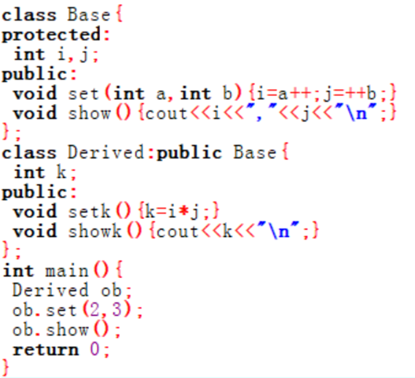

### 2402 - OOP - 上机4 - Lancer

------

#### 判断题

1. 虚函数是用virtual 关键字说明的成员函数。(T)
2. int i; int &ri=i；对于这条语句，ri和i这两个变量代表的是同一个存储空间。(T)
3. 静态数据成员不能在类中初始化，使用时需要在类体外声明。(T)
4. C++程序中，一个类的析构函数可以被重载。(F)
5. 抽象类是指一些没有说明对象的类。(F)
6. 对于从基类继承的虚函数，派生类也可以不进行重定义。(T)
7. 基类中的私有成员不论通过何种派生方式，到了派生类中均变成不可直接访问成员。(T)
8. 将构造函数说明为纯虚函数是没有意义的。(T)
9. 动态绑定是在运行时选定调用的成员函数的。(T)

------

#### 单选题

1. （2023final）C++中的模板包括(   )。（D）

   A. 对象模板和函数模板

   B. 对象模板和类模板

   C. 变量模板和对象模板

   **D. 函数模板和类模板**

2. 关于动态绑定的下列描述中，（ ）是错误的。（D）

   A. 动态绑定是以虚函数为基础的

   B. 动态绑定在运行时确定所调用的函数代码

   C. 动态绑定调用函数操作是通过指向对象的指针或对象引用来实现的

   **D. 动态绑定是在编译时确定操作函数的**

3. 有关类和对象的说法下列不正确的有（ ）。（C）

   A. 对象是类的一个实例

   B. 任何一个对象只能属于一个具体的类

   **C. 一个类只能有一个对象**

   D. 类与对象和关系与数据类型和变量的关系相似

4. （2023final）对于类定义（D）

   class A {
   public：
       virtual void func1 (  ) {  };
       void func2 (  ) {  };
   }；
   class B：public A
   {
   public：
       void func1 (  ) { cout<< ”class B func 1”<

   A. A::func2 ( )和B::func1 ( )都是虚函数

   B. A::func2 ( )和B::func1 ( )都不是虚函数

   C. B::func1 ( )不是虚函数，而A::func2 ( )是虚函数

   **D. B::func1 ( )是虚函数，而A::func2 ( )不是虚函数**

5. 在下列关键字中,用以说明类中公有成员的是（ ）。（A）

   **A. public**

   B. private

   C. protected

   D. friend

6. 下列关于运算符重载的描述中，（ ）是正确的。（D）

   A. 运算符重载可以改变操作数的个数

   B. 运算符重载可以改变优先级

   C. 运算符重载可以改变结合性

   **D. 运算符重载不可以改变语法结构**

7. （2023final）定义一个函数名为fun，返回值为int，没有参数的纯虚函数。正确定义是( )。（A）

   **A. virtual int fun()=0;**

   B. int  virtual fun()=0;

   C. virtual int fun();

   D. int fun()=0 virtual;

8. 关于虚函数的描述中，（ ）是正确的。（C）

   A. 虚函数是一个static 类型的成员函数

   B. 虚函数是一个非成员函数

   **C. 基类中说明了虚函数后，派生类中与其对应的函数可不必说明为虚函数**

   D. 派生类的虚函数与基类的虚函数具有不同的参数个数和类型

9. 关于纯虚函数和抽象类的描述中，（ ）是错误的。（C）

   A. 纯虚函数是一种特殊的虚函数，它没有具体的实现

   B. 抽象类是指具有纯虚函数的类

   **C. 一个基类中说明有纯虚函数，该基类的派生类一定不再是抽象类**

   D. 抽象类只能作为基类来使用，其纯虚函数的实现由派生类给出

10. 类的实例化是指（   ）。（B）

   A. 定义类

   **B. 定义对象**

   C. 调用类的成员函数

   D. 访问对象的数据成员

11. （2023final）下列程序段的输出结果是（ ）。（B）

   

   A. 2,3

   **B. 2,4**

   C. 3,4

   D. 编译错误

12. 在下面类声明中，关于生成对象不正确的是（ ）。（C）

   class point
   { public:
            int x;
            int y;
            point(int a,int b)   {x=a;y=b;}
   };

   A. point p(10,2);

   B. point *p=new    point(1,2);

   **C. point *p=new point[2];**

   D. point *p[2]={new point(1,2), new  point(3,4)};

13. 在公有继承的情况下，在派生类中能够访问的基类成员包括（D）

   A. 公有成员

   B. 保护成员

   C. 公有成员、保护成员和私有成员

   **D. 公有成员和保护成员**

14. 如何区分自增运算符重载的前置形式和后置形式？（B）

   A. 重载时，前置形式的函数名是++operator，后置形式的函数名是operator ++

   **B. 后置形式比前置形式多一个 int 类型的参数**

   C. 无法区分，使用时不管前置形式还是后置形式，都调用相同的重载函数

   D. 前置形式比后置形式多一个 int 类型的参数

15. 下列哪一项说法是不正确的?（D）

   A. 运算符重载的实质是函数重载

   B. 运算符重载可以重载为普通函数,也成员可以重载为成员函数

   C. 运算符被多次重载时,根据实参的类型决定调用哪个运算符重载函数

   **D. 运算符被多次重载时,根据函数类型决定调用哪个重载函数**

16. 析构函数可以返回：（D）

   A. 指向某个类的指针

   B. 某个类的对象

   C. 状态信息表明对象是否被正确地析构

   **D. 不可返回任何值**

17. 所有类都应该有：（C）

   A. 构造函数

   B. 析构函数

   **C. 构造函数和析构函数**

   D. 以上答案都不对

18. 下列运算符中，（ ）运算符不能重载。（C）

   A. ＆＆

   B. [ ]

   **C. ::**

   D. <<

19. 建立一个类对象时，系统自动调用（A）

   **A. 构造函数**

   B. 析构函数

   C. 友元函数

   D. 成员函数

20. 下列对重载函数的描述中，（ ）是错误的。（A）

   **A. 重载函数中不允许使用默认参数**

   B. 重载函数中编译根据参数表进行选择

   C. 不要使用重载函数来描述毫无相干的函数

   D. 构造函数重载将会给初始化带来多种方式

21. 下列函数中，（ ）不能重载。（C）

   A. 成员函数

   B. 非成员函数

   **C. 析构函数**

   D. 构造函数

22. 若obj是类D的对象，则下列语句中正确的是（D）

   ```C++
   class B{
   private: void fun1(){ }
   protected: void fun2(){ }
   public: void fun3(){ }
   };
   class D : public B {
   protected: void fun4(){ }
   };
   ```

   A. obj.fun1();

   B. obj.fun2();

   C. obj.fun4();

   **D. obj.fun3();**


------

#### 程序填空题

1.复数的加法及输出

下述程序从控制台读取一个复数b的实部和虚部，然后将这个复数与复数a及实数3.2相加，得到复数c并输出。请参考注释将程序补充完整。

```
#include <iostream>
#include <iomanip>
using namespace std;

class Complex {
    double dReal;
    double dImage;
public:
//构造函数
/*（Complex(double r = 0.0, double i = 0.0) : dReal(r), dImage(i) {}）（3分）*/

//operator+操作符函数
/*（Complex operator+(const Complex& other) const {
    return Complex(dReal + other.dReal, dImage + other.dImage);
}）（4分）*/

//友元函数声明以帮助operator<<()函数访问Complex类的私有成员
/*（friend ostream& operator<<(ostream& o, const Complex& c);）（3分）*/
};

ostream& operator<<(ostream& o, const Complex& c){
    o << fixed << setprecision(1) << c.dReal << " + " << c.dImage << "i";
    return o;
}

int main() {
    double dReal, dImage;
    cin >> dReal >> dImage;

    Complex a(1,1);
    Complex b(dReal,dImage);
    Complex c = a + b + 3.2;
    cout << c << endl;
    return 0;
}
```

**拼尽全力还是不会？参考B站习题讲解**
哔哩哔哩up主：[海洋饼干叔叔](https://space.bilibili.com/384177380) [Python课程](https://www.bilibili.com/video/BV1kt411R7uW/) [Python习题](https://www.bilibili.com/video/BV1iL411t7UZ/)[简洁的C和C++](https://www.bilibili.com/video/BV1it411d7zx/)作者每天分享一篇关于C/C++/Python的技术文章，学习编程不迷路。

2.B Fill in the blanks

Run the following program, the output is:   B::f()

```c++
#include <iostream>
using namespace std;
class A{
public:
    /*（virtual void f()）（1分）*/{ cout<<"A::f()
"; }
 };
class B:public A{
 public:
	  void f() {cout<<"B::f()
"; }
 };
int main()
{
   B b;
   A &p /*（= b）（1分）*/;
   /*（p.）（1分）*/f();
   return 0;
}
```

3.点类的定义和使用

已知平面上的一点由其横纵坐标来标识。本题要求按照已给代码和注释完成一个基本的“点”类的定义（坐标均取整型数值）。并通过主函数中的点类对象完成一些简单操作，分析程序运行结果，将答案写在对应的空格中。

```c++
#include </*（iostream）（1分）*/>
using namespace std;

class Point
{
/*（private:）（1分）*///访问权限设置，私有权限
	int x;//横坐标
	int y;//纵坐标
/*（public:）（1分）*///访问权限设置，公有权限

	//以下为构造函数，用参数a,b分别为横纵坐标进行初始化
	/*（Point）（2分）*/(int a,int b)
	{
		/*（x = a）（1分）*/;
		/*（y = b）（1分）*/;
	}

	//以下为拷贝构造函数，借用对象a_point完成初始化
	Point(/*（const Point &）（2分）*/a_point)
	{
		x=a_point.x;
		y=a_point.y;
	}

	//以下为析构函数
	/*（~Point()）（2分）*/
	{
		cout<<"Deconstructed Point";
		print();
	}

	//以下为输出点的信息的函数，要求在一行中输出点的坐标信息，形如：(横坐标,纵坐标)
	void print()
	{
		cout<</*（"(" << x << "," << y << ")"）（2分）*/<<endl;
	}
};

int main()
{
	Point b_point(0,0);
	b_point.print();
	int a,b;
	/*（cin >> a >> b;）（2分）*///从标准输入流中提取数值给a,b
	Point c_point(a,b);
	c_point.print();
  /*（return 0;）（1分）*///主函数的返回语句
}
/*设输入为10 10，则本程序的运行结果为：
/*（(0,0)）（1分）*/
/*（(10,10)）（1分）*/
/*（Deconstructed Point(10,10)）（1分）*/
/*（Deconstructed Point(0,0)）（1分）*/
*/

```


------

#### 函数题

##### 1.体育俱乐部I（构造函数）

一个俱乐部需要保存它的简要信息，包括四项：名称（字符串），成立年份（整数），教练姓名（字符串）和教练胜率（0－100之间的整数）。用键盘输入这些信息后，把它们分两行输出：第一行输出名称和成立年份，第二行输出教练姓名和胜率。
**裁判测试程序样例：**
```c++
#include
#include
using namespace std;
class Coach{
string name;
int winRate;
public:
Coach(string n, int wr){
name=n; winRate=wr;
}
void show();
};
class Club{
string name;
Coach c;
int year;
public:
Club(string n1, int y, string n2, int wr);
void show();
};
int main(){
string n1, n2;
int year, winRate;
cin>>n1>>year>>n2>>winRate;
Club c(n1,year, n2, winRate);
c.show();
return 0;
}
/* 请在这里填写答案 */
```
**输入样例：**
```in
Guanzhou 2006 Tom 92
```
**输出样例：**
```out
Guanzhou 2006
Tom 92%
```

**code:**

```c++
Club::Club(string n1, int y, string n2, int wr) : name(n1), year(y), c(n2, wr){}
void Coach::show(){
    cout << name << " " << winRate << "%\n";
}
void Club::show(){
    cout << name << " " << year << endl;
    c.show();
}
```

##### 2.对象指针与对象数组（拉丁舞）

对象指针与对象数组（拉丁舞）
怡山小学毕业文艺晚会上，拉丁舞是最受欢迎的节目。不过，每年为了排练这个节目，舞蹈组都会出现一些纠纷。有些同学特别受欢迎，有些却少人问津，因此安排舞伴成为舞蹈组陈老师最头疼的问题。
为了解决这一问题，今年陈老师决定让按先男生后女生，先低号后高号的顺序，每个人先报上自己期待的舞伴，每人报两位，先报最期待的舞伴。接下来按先男生后女生，先低号后高号的顺序，依次按以下规则匹配舞伴：
（１）每个人均按志愿顺序从前到后确定舞伴。如果第一志愿匹配不成功，则考虑第二志愿。
（２）如果Ａ的当前志愿为Ｂ，则如果Ｂ未匹配舞伴，且有以下情形之一者，Ａ和Ｂ匹配成功：
2a) B的期待名单中Ａ。
2b) Ｂ的期待名单中没有Ａ，但Ｂ期待的两位舞伴均已匹配成功，所以Ｂ只能与Ａ凑合。
输入时先输入男生数m, 接下来m行，第一项为学生的姓名，后两项为期待舞伴的编号，编号从０开始，最大为女生数减１。接下来输入女生数f，接下来f行，第一项为学生的姓名，后两项为期待舞伴的编号，编号从0开始，最大为男生数减１。
输出时按男生的编号顺序输出　　姓名:舞伴姓名
注意两个姓名间有冒号隔开
**函数接口定义：**
```c++
Student的两个成员函数：
void printPair();
void addPair();
```
**裁判测试程序样例：**
```c++
#include
#include
using namespace std;
const int K=2;
const int N=20;
class Student{
string name;
Student *welcome[K];
Student *pair;
public:
void init(string &name, Student *a, Student *b) {
this->name=name;
welcome[0]=a;
welcome[1]=b;
pair=NULL;
}
void printPair();
void addPair();
};
/* 请在这里填写答案 */
int main(){
Student male[N], female[N];
int m, f, i, j, a, b;
string name;
cin>>m;
for(i=0;i>name>>a>>b;
male[i].init(name, ♀[a], ♀[b]);
}
cin>>f;
for(i=0;i>name>>a>>b;
female[i].init(name, ♂[a], ♂[b]);
}
for(i=0;i<m;i++) male[i].addPair();
for(i=0;i<f;i++) female[i].addPair();
for(i=0;i<m;i++) male[i].printPair();
return 0;
}
```
**输入样例：**
```in
5
M0 3 1
M1 1 3
M2 1 4
M3 3 1
M4 0 3
5
F0 0 2
F1 2 0
F2 2 1
F3 2 4
F4 3 2
```
**输出样例：**
```out
M0:F1
M2:F4
M4:F0
```
说明：匹配过程如下：
（１）M0先选择F3, 但F3并未期待M0；接下来M0选择F1, F1也期待M0，故匹配成功。
（２）Ｍ１选择F1, 但F1已匹配，故,不成功；Ｍ１选择Ｆ３，但Ｆ３未期待M1，仍然不成功。
（３）Ｍ２选择Ｆ１，Ｆ１已匹配；Ｍ２选择Ｆ４，　Ｆ４未匹配且也期待Ｍ２，故匹配成功。
（４）Ｍ３选择Ｆ３，但Ｆ３未期待他，不成功；Ｍ３选择Ｆ１，Ｆ１已匹配，不成功。
（５）Ｍ４选择Ｆ０，　Ｆ０不期待Ｍ４，但是Ｆ０期待的Ｍ０和Ｍ２已分配，所以凑合，匹配成功。
（６）Ｆ０已匹配，　Ｆ１已匹配。
（７）Ｆ２选择Ｍ２，　Ｍ２已匹配，不成功；　Ｆ２选择Ｍ１，　Ｍ１未匹配，但期待表中没有Ｆ２，且Ｆ３也未分配，故不成功。
（８）Ｆ３选择Ｍ２，　Ｍ２已匹配，不成功；Ｆ３选择Ｍ４，　Ｍ４已匹配，不成功。
（９）Ｆ４已匹配。

**code:**

```c++
void Student::printPair() {
    if (pair != nullptr) cout << name << ":" << pair->name << endl;
}

void Student::addPair() {
    if (pair != nullptr) return;
    for (int i = 0; i < K; ++i) {
        Student* target = welcome[i];
        if (target == nullptr || target->pair != nullptr) continue;
        bool condition2a = false;
        for (int j = 0; j < K; ++j) {
            if (target->welcome[j] == this) {
                condition2a = true;
                break;
            }
        }
        bool condition2b = true;
        for (int j = 0; j < K; ++j) {
            Student* expect = target->welcome[j];
            if (expect == nullptr || expect->pair == nullptr) {
                condition2b = false;
                break;
            }
        }
        if (condition2a || condition2b) {
            pair = target;
            target->pair = this;
            return;
        }
    }
}
```

##### 3.表彰优秀学生（多态）

学期结束，班主任决定表彰一批学生，已知该班学生数在6至50人之间，有三类学生：普通生，特招运动员，学科专长生，其中学科专长生不超过5人。
主函数根据输入的信息，相应建立GroupA, GroupB, GroupC类对象。
GroupA类是普通生，有2门课程的成绩（均为不超过100的非负整数）；
GroupB类是特招运动员，有2门课程的成绩（均为不超过100的非负整数），1次运动会的表现分，表现分有：A、B、C、D共4等。
GroupC类是学科专长生，有5门课程的成绩（均为不超过100的非负整数）。
表彰人员至少符合以下3个条件中的一个：
（1）2门课程平均分在普通生和特招运动员中，名列第一者。
a.该平均分称为获奖线。
b.存在成绩并列时，则全部表彰，例如某次考试有2人并列第1，则他们全部表彰。
（2）5门课程平均分达到或超过获奖线90%的学科专长生，给予表彰。
（3）2门课程平均分达到或超过获奖线70%的特招运动员，如果其运动会表现分为A，给予表彰。
输入格式：每个测试用例占一行，第一项为类型，1为普通生，2为特招运动员，3为学科专长生, 输入0表示输入的结束。第二项是学号，第三项是姓名。对于普通生来说，共输入5项，第4、5项是课程成绩。对于特招运动员来说，共输入6项，第4、5项是课程成绩，第6项是运动会表现。对于学科专长生来说，共输入8项，第4、5、6、7、8项是课程成绩。
输出时，打印要表彰的学生的学号和姓名。(输出顺序与要表彰学生的输入前后次序一致)
**函数接口定义：**
```c++
以Student为基类，构建GroupA, GroupB和GroupC三个类
```
**裁判测试程序样例：**
```c++
#include
#include
using namespace std;
/* 请在这里填写答案 */
int main()
{
const int Size=50;
string num, name;
int i,ty,s1,s2,s3,s4,s5;
char gs;
Student *pS[Size];
int count=0;
for(i=0;i>ty;
if(ty==0) break;
cin>>num>>name>>s1>>s2;
switch(ty){
case 1:pS[count++]=new GroupA(num, name, s1, s2); break;
case 2:cin>>gs; pS[count++]=new GroupB(num, name, s1,s2, gs); break;
case 3:cin>>s3>>s4>>s5; pS[count++]=new GroupC(num, name, s1,s2,s3,s4,s5); break;
}
}
for(i=0;idisplay();
delete pS[i];
}
return 0;
}
```
**输入样例：**
```in
1 001 AAAA 96 80
2 009 BBB 82 75 A
1 007 CC 100 99
3 012 CCCC 97 95 90 99 93
1 003 DDD 62 50
1 022 ABCE 78 92
2 010 FFF 45 40 A
3 019 AAA 93 97 94 82 80
0
```
**输出样例：**
```out
009 BBB
007 CC
012 CCCC
```

**code:**

```c++
#include <vector>
class GroupA;
class GroupB;
class GroupC;
class Student {
protected:
    string num;
    string name;
    static vector<Student*> allStudents;
    static double awardLine;
    static bool calculated;
public:
    Student(string num, string name) : num(num), name(name) {
        allStudents.push_back(this);
    }
    virtual ~Student() {}
    virtual void display() = 0;
    static void calculateAwardLine();
};
vector<Student*> Student::allStudents;
double Student::awardLine = -1;
bool Student::calculated = false;
class GroupA : public Student {
private:
    int s1, s2;
public:
    GroupA(string num, string name, int s1, int s2)
        : Student(num, name), s1(s1), s2(s2) {}
    void display() override {
        Student::calculateAwardLine();
        double avg = (s1 + s2) / 2.0;
        if (avg == awardLine) cout << num << " " << name << endl;
    }
    friend void Student::calculateAwardLine();
};
class GroupB : public Student {
private:
    int s1, s2;
    char gs;
public:
    GroupB(string num, string name, int s1, int s2, char gs)
        : Student(num, name), s1(s1), s2(s2), gs(gs) {}
    void display() override {
        Student::calculateAwardLine();
        double avg = (s1 + s2) / 2.0;
        if (avg == awardLine) {
            cout << num << " " << name << endl;
        } else if (gs == 'A' && avg >= awardLine * 0.7) {
            cout << num << " " << name << endl;
        }
    }
    friend void Student::calculateAwardLine();
};
class GroupC : public Student {
private:
    int s1, s2, s3, s4, s5;
public:
    GroupC(string num, string name, int s1, int s2, int s3, int s4, int s5)
        : Student(num, name), s1(s1), s2(s2), s3(s3), s4(s4), s5(s5) {}
    void display() override {
        Student::calculateAwardLine();
        double avg = (s1 + s2 + s3 + s4 + s5) / 5.0;
        if (avg >= awardLine * 0.9) {
            cout << num << " " << name << endl;
        }
    }
};
void Student::calculateAwardLine() {
    if (calculated) return;
    double maxAvg = -1;
    for (Student* s : allStudents) {
        if (GroupA* a = dynamic_cast<GroupA*>(s)) {
            double avg = (a->s1 + a->s2) / 2.0;
            if (avg > maxAvg) maxAvg = avg;
        } else if (GroupB* b = dynamic_cast<GroupB*>(s)) {
            double avg = (b->s1 + b->s2) / 2.0;
            if (avg > maxAvg) maxAvg = avg;
        }
    }
    awardLine = maxAvg;
    calculated = true;
}
```


------

#### 编程题

##### 1.（2023final）小动物们吃什么？（多态）

请编写一个关于动物的类 Animal，该类包含一个公共函数 eat()，输出“Animal is eating.”

接下来，请编写五个子类 Cat ， Dog ， Lion ， Panda ， Rabbit ，分别继承自父类 Animal，并覆盖 eat().

Cat 的 eat() 函数应该输出“Cat is eating fish.”；

Dog 的 eat() 函数应该输出“Dog is eating bone.”；

Lion 的 eat() 函数应该输出“Lion is eating meat.”；

Panda 的 eat() 函数应该输出“Panda is eating bamboo.”；

Rabbit 的 eat() 函数应该输出“Rabbit is eating carrot.”.

(注意，所有输出的结尾只有句点，没有换行).

先输入一个数字N，表示小动物的个数，N不超过5。

随后输入N个小动物的名字。

最后，请在主函数中创建一个 Animal 类的指针，让它:

(1) 先指向第一个小动物对象，比如Cat 对象，调用 Cat 的 eat() 函数，并输出结果;

(2) 然后将这个指针改为指向第二个小动物对象，比如 Dog 对象，再次调用Dog 的 eat() 函数，并输出结果。

(3) 将这个指针改为指向第三个小动物对象……直到把N个小动物吃什么都输出完毕。

**输入格式:**

首先输入一个数字N，随后输入N个小动物的名字，间隔符为空格。

**输出格式:**

按顺序输出每个小动物吃什么，注意，所有输出的结尾只有句点，没有换行。

**输入样例:**

在这里给出一组输入。例如：

```in
4 Cat Lion Dog Rabbit
```

**输出样例:**

在这里给出相应的输出。例如：

```out
Cat is eating fish.Lion is eating meat.Dog is eating bone.Rabbit is eating carrot.
```

**code:**

```c++
#include <iostream>

using namespace std;

class Animal{
public:
    virtual void eat(){
        cout << "Animal is eating.";
        return;
    }
};

class Cat:public Animal{
public:
	void eat(){
        cout << "Cat is eating fish.";
        return;
    }
};

class Dog:public Animal{
public:
	void eat(){
        cout << "Dog is eating bone.";
        return;
    }
};

class Lion:public Animal{
public:
	void eat(){
        cout << "Lion is eating meat.";
        return;
    }
};

class Panda:public Animal{
public:
	void eat(){
        cout << "Panda is eating bamboo.";
        return;
    }
};

class Rabbit:public Animal{
public:
	void eat(){
        cout << "Rabbit is eating carrot.";
        return;
    }
};

int main(){
	int n;
	cin >> n;
	while(n--){
		string h;
		cin >> h;
		if(h == "Cat"){
			Animal *p = new Cat;
			p->eat();
		}else if(h == "Dog"){
			Animal *p = new Dog;
			p->eat();
		}
		else if(h == "Lion"){
			Animal *p = new Lion;
			p->eat();
		}else if(h == "Panda"){
			Animal *p = new Panda;
			p->eat();
		}else if(h == "Rabbit"){
			Animal *p = new Rabbit;
			p->eat();
		}
	}
	return 0;
}
```

##### 2.(2023final)自适应数组模板

通常数组一旦申请，其大小就不可变化。但实际应用中，数组元素个数变化较大，因此，有必要设计一种自适应数组，可以随着存储数组元素的实际需要动态扩容或者缩小容量，以增加空间利用效率。

为此，请设计一个自适应数组模板类scale_array，支持以下功能：

（1）     初始化时根据指定长度申请动态数组

（2）     支持insert(x)运算：将元素x存储至数组的第一个空闲单元中，当数组已满，需先将数组扩容至当前数组长度的3/2倍，再进行元素插入

（3）     支持lastdelete( )运算：若数组为空数组，则返回“empty”，否则将数组中最后一个非空数组单元存储元素x删除并返回，且若元素x删除后，有一半及以上数组单元空闲时，将数组长度缩减至当前数组长度的3/4倍

（4）     支持capacity( )运算：返回当前数组剩余空闲数组单元数量

（5）     该自适应数组可用于各种标准数据类型，和标准数组一样支持下标运算

（6）     任何时候数组长度都不小于2

请根据以上要求，完成该自适应数组模板类scale_array。

所有输入均合法。

**输入格式:**

第一行输入一个整数M，代表着接下来有M组操作

每一组操作由若干行操作组成

每一行为一个操作，每行的第一个字符为操作类型，共有5种不同操作。

N为新建一个自适应数组，接着输入两个整数，第一个整数代表数组长度，第二个整数代表数据类型，1为int，2为double，3为char

I为插入操作，接着输入一个数据，为待插入元素，保证输入数据类型合法

D为删除操作

C为查询容量操作

E为结束操作

每组操作第一行肯定是N操作，最后以E操作结束

**输出格式:**

对于D操作，输出被删除的元素或者empty（数组为空时）

对于C操作，输出剩余空闲数组单元数量

**输入样例:**

以下为一组输入：

```in
3
N 5 1
I 12
I 23
I 34
I 45
I 56
I 67
C
D
E
N 3 2
I 12.34
D
C
E
N 6 3
I A
I B
I C
I D
I E
D
C
E

```

**输出样例:**

在这里给出相应的输出。例如：

```out
1
67
12.34
2
E
2

```

**code:**

```c++
#include <iostream>
#include <string>
#include <algorithm>
using namespace std;
template <typename T>
class scale_array {
private:
    T* data;
    size_t capacity_;
    size_t size_;
public:
    scale_array(size_t initial_capacity) : capacity_(initial_capacity), size_(0) {
        data = new T[capacity_];
    }
    ~scale_array() {
        delete[] data;
    }
    void insert(T x) {
        if (size_ == capacity_) {
            size_t new_cap = max(capacity_ * 3 / 2, capacity_ + 1);
            new_cap = max(new_cap, static_cast<size_t>(2));
            T* new_data = new T[new_cap];
            for (size_t i = 0; i < size_; i++) new_data[i] = data[i];
            delete[] data;
            data = new_data;
            capacity_ = new_cap;
        }
        data[size_++] = x;
    }
    void lastdelete() {
        if (size_ == 0) {
            cout << "empty" << endl;
            return;
        }
        T val = data[--size_];
        size_t free = capacity_ - size_;
        if (free * 2 >= capacity_) {
            size_t new_cap = max(static_cast<size_t>(capacity_ * 3 / 4), size_);
            new_cap = max(new_cap, static_cast<size_t>(2));
            if (new_cap < capacity_) {
                T* new_data = new T[new_cap];
                for (size_t i = 0; i < size_; i++) new_data[i] = data[i];
                delete[] data;
                data = new_data;
                capacity_ = new_cap;
            }
        }
        cout << val << endl;
    }
    size_t capacity() const {
        return capacity_ - size_;
    }
    T& operator[](size_t index) {
        return data[index];
    }
    const T& operator[](size_t index) const {
        return data[index];
    }
};
int main() {
    int M;
    cin >> M;
    while (M--) {
        char op;
        cin >> op; // 'N'
        int initial_len, data_type;
        cin >> initial_len >> data_type;
        if (data_type == 1) {
            scale_array<int> arr(initial_len);
            while (cin >> op) {
                if (op == 'E') break;
                if (op == 'I') {
                    int x;
                    cin >> x;
                    arr.insert(x);
                } else if (op == 'D') arr.lastdelete();
                else if (op == 'C') cout << arr.capacity() << endl;
            }
        } else if (data_type == 2) {
            scale_array<double> arr(initial_len);
            while (cin >> op) {
                if (op == 'E') break;
                if (op == 'I') {
                    double x;
                    cin >> x;
                    arr.insert(x);
                } else if (op == 'D') arr.lastdelete();
                else if (op == 'C') cout << arr.capacity() << endl;
            }
        } else if (data_type == 3) {
            scale_array<char> arr(initial_len);
            while (cin >> op) {
                if (op == 'E') break;
                if (op == 'I') {
                    char x;
                    cin >> x;
                    arr.insert(x);
                } else if (op == 'D') arr.lastdelete();
                else if (op == 'C') cout << arr.capacity() << endl;
            }
        }
    }
    return 0;
}
```


------
